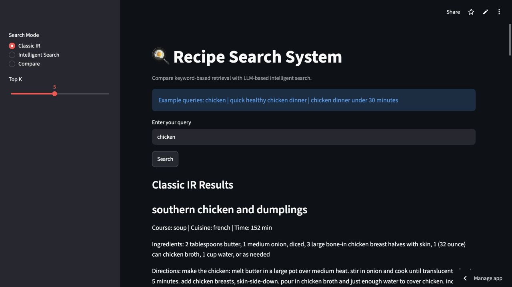
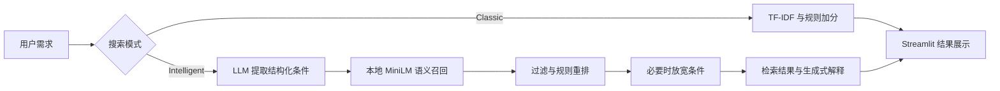

<div align="center">

# Recipe Search · 智能食谱检索

**从食材关键词到自然语言需求，比较两种检索方式如何找到合适的食谱。**

[在线体验 Live Demo](https://recipe-search-axnlh6mrsojdev2wplwfua.streamlit.app/) · [架构与评估](PROJECT_NOTES.md) · [快速运行](#快速运行)

`Python` · `Streamlit` · `TF-IDF` · `Sentence Transformers` · `OpenAI`

**4,000 条食谱 · 3 种交互模式 · 可查看食材与做法**

</div>



> 截图为 Classic IR 的真实运行结果，不代表智能检索的效果评估。免费托管可能休眠；智能模式需要可用的 OpenAI API 配置及额度。

## 为什么做这个项目

“chicken”和“quick healthy chicken dinner”表达的是不同层次的需求。关键词检索容易定位词语，却不一定能同时理解食材、用餐场景、烹饪时间和偏好。本项目把传统检索与自然语言驱动检索放在同一界面，方便观察准确匹配、语义召回与约束满足之间的取舍。

## 三种模式

| 模式 | 实际实现 | 是否调用生成式 API |
|---|---|---|
| Classic IR | TF-IDF 余弦相似度，叠加标题和元数据等规则加分；检索函数支持结构化过滤 | 否 |
| Intelligent Search | GPT-4o-mini 解析需求 → 本地 MiniLM 语义召回 → 规则重排 → 基于结果生成解释 | 是，解析及可选的解释 |
| Compare | 并排展示两条检索路径，观察结果差异 | 智能分支会调用 |

嵌入模型为 `all-MiniLM-L6-v2`，在应用运行环境中编码文本，通过 NumPy 向量点积检索；本项目没有使用 Chroma。规则重排不是额外训练的神经重排模型。

## 工作流程



可以先用 `chicken` 体验 Classic IR，再在智能模式尝试 `quick healthy chicken dinner` 或 `chicken dinner under 30 minutes`。后两项是建议体验题，不是已通过的准确率测试。

## 数据内容

随仓库提供 `data/recipes_project_subset_4000.csv`，经行数核对包含 **4,000 条记录、46 个字段**。主要包括：

| 内容 | 字段示例 |
|---|---|
| 食谱正文 | recipe_title、description、ingredients、directions |
| 烹饪信息 | total_time_min、num_steps、difficulty |
| 分类与口味 | cuisine_primary、course_primary、main_ingredient、tastes |
| 饮食与健康标签 | is_vegetarian、is_nut_free、healthiness_score、health_flags |
| 检索文本 | search_text、ingredients_text_clean、directions_text_clean |

部分字段是估计值或整理后的标签。原始来源、标注方法及再分发许可尚未在现有仓库中完整说明，不能把这些标签视为经过专业验证的结论。

## 快速运行

建议使用独立的 Python 3.11 环境；在仓库根目录执行：

```bash
python -m venv .venv
source .venv/bin/activate
pip install -r requirements.txt
cp .env.example .env
streamlit run recipe.py
```

Classic IR 不需要 API Key。智能模式需在本地 `.env` 填写自己的 `OPENAI_API_KEY`；Streamlit Cloud 使用应用 Settings → Secrets 的顶层配置。不要将真实密钥提交到 GitHub。首次智能检索可能需要下载模型和建立嵌入缓存。

## 验证与边界

- 2026-10-07：确认数据为 4,000 条；线上 Classic IR 查询 `chicken` 成功返回结果。
- 支持两种方法的可视化对照，但目前未发布经过标注集验证的 Precision@K、NDCG、延迟或 API 成本对比。
- 英文数据与英文嵌入模型为主，不能据此声称中英文效果等价。
- 时间条件采用软约束，当前结果选择逻辑允许一定超时；无结果时会放宽条件，最终回退可能取消排除条件。不能用于保证过敏原排除或严格饮食安全。
- 生成式解释可能有误；应以食材、做法及实际结果为准。

更多设计取舍、待评估指标和代码入口见 [PROJECT_NOTES.md](PROJECT_NOTES.md)。

## English overview

A Streamlit prototype comparing a TF-IDF baseline with LLM-assisted recipe retrieval over 4,000 recipes. The intelligent path combines OpenAI query parsing, local MiniLM embeddings, heuristic reranking and result-grounded explanations. The comparison UI supports inspection; it is not a published retrieval benchmark. Soft constraints and fallback behavior require manual checking.
